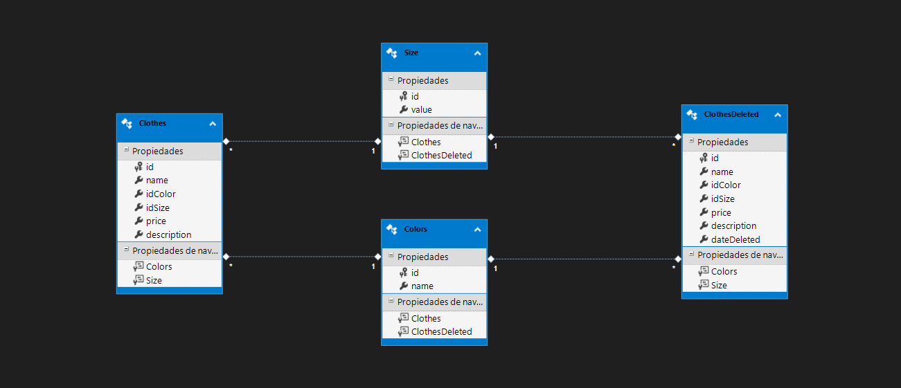

# ClothesStoreAPI

# Little general explanation:

This API is designed to manage the CRUD operations of an online clothing store, as requested in the technical test specification. For this purpose, I have created a database composed of four tables: Clothes, Colors, Sizes, and DeletedClothes. The design is as follows:

For this API, I used .NET Framework with:

ADO.NET to import the models from the database directly from SQL Server and ASP.NET to handle the calls following the MVC pattern.

For dependency injection, I used the Unity NuGet package.

For unit tests, I used xUnit project and Moq NuGet package.

# Reviewing the API and its correct functionality:

To properly review the functionality of this API, I have included a folder named Resources at the root of the project. This folder contains scripts to generate the database as well as the Postman collection to import and have the different API calls available.

# Steps to follow:

1) Execute the script for the database schema (Resources/ScriptsDB/TablesSchema.sql).
2) (Optional) Execute the script with the test data (Resources/ScriptsDB/exampleDataScheme.sql).
3) Execute the script with the trigger (Resources/ScriptsDB/scriptTrigger.sql). This trigger will help us store the data of the deleted items from the original table in a secondary table to avoid losing them permanently or to allow us to recover them in case of accidental deletion.

Once this is done, everything should work correctly.

For your convenience, I am providing the Postman collection (Resources/Postman/ClothesStore.postman_collection.json).

Greetings, and for any questions or comments, you can contact me,

Enrique Guevara Cameselle